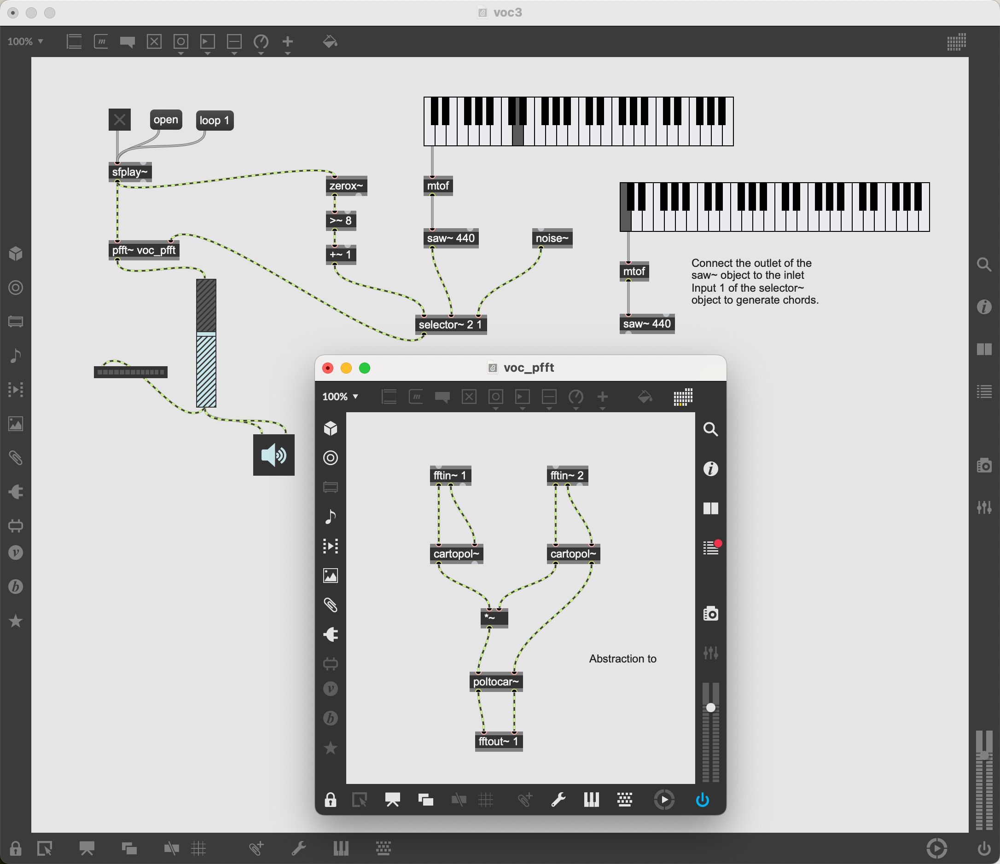
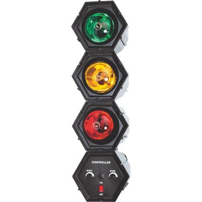
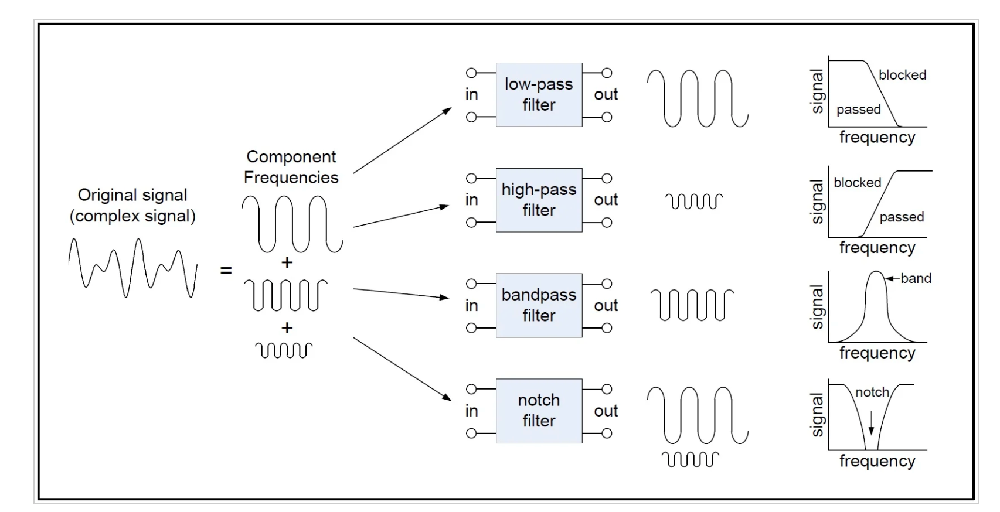
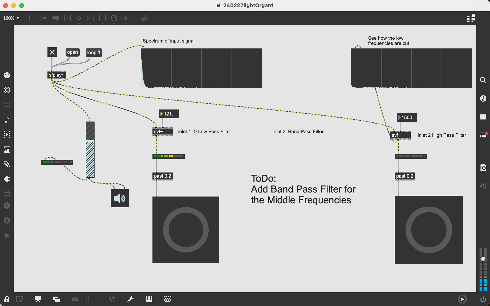

# Vocoder and more

This session is dedicated to the Vocoder, a device to modify the human voice. Furthermore, we use some patches to visualise sound and customize
the appearance of MAX/MSP objects with the inspector.

The music band "Kraftwerk" became popular with their title ["The Robots"](https://youtu.be/D_8Pma1vHmw?feature=shared) back in 1978.

Their music relied heavily on Synthezisers and Vocoder to create their unique sound.

### 1. Create one or two recordings with voice

Record two audio clips to get some speech samples, 

- a longer one with a duration of approx. 30 sec (maybe read a book or text?)
- another shorter xlip with just a short sentence.

The video below shows you the basic process using Audacity, while the interface of the actual version 3.X has changed,
the elements used are still available on the user interface, only their location is different.

Before you start, you need to set in `Audio Setup` the proper `Recording Device`, your microphone. Also, activate the `Record Meter`
to see a level meter show the volume. Your voice should be around -6dB, avoiding a red level.

[Quick introduction on how to record with Audacity][(https://www.youtube.com/embed/knL6uKBGyIg?si=72jXXYisA7fn-xv5)
  web-share" allowfullscreen></iframe>

At the end do not forget to `Export` your audio clip, either in the .WAV or the .MP3 format.

### 2. Launch the patch 240226_VocoderBEAP1.maxpat

As in previous sessions, download the repository with all contents on your computer, if required extract its files. Then find
and laumch the patch **240226_VocoderBEAP1.maxpat**.
Drag and drop on of your audio clips on the patch, a `playlist~` object will be created. Patch it as it is shown for the existing player.

Then start the patch and experiment with various settings on the Vocoder module.

### 3. A descrete Vocoder vox2.maxpat

This Vocoder is described [here](https://youtu.be/4feOFLX6238?feature=shared) in more detail. You find it in the folder **Vocoder2**. 
The project consists out of two patches. The main patch vox2.maxpat contains the main program, it uses a subprogram **voc_pfft.maxpat**,
subprograms in MAX are called *Abstractions*. 

Launch the main patch **voc2.maxpat**, click on the `open` message, a widget will pop up that allows you to select an audio file. Then click on the toggle to start the patch. You can modulate the recorded voice by playing the kslider (keyboard).

### 4. A more sophisticated Vocoder vox3.maxpat

If you listen attentively to the synthezised voice, you notice that it is difficult to hear your consonants. The new patch vox3.maxpat uses a technique called 
[Zero Crossing Rate](https://dsp.stackexchange.com/questions/8069/distinguish-vowels-from-consonants) to identify consonants in the speech pattern and modulate those sounds with  a noise. Compare the outcome with that of the previous  one.

### 5. Visualise sound

A [Light Organ](https://en.wikipedia.org/wiki/Light_organ) is a tool to visualise sound frequencies with different coloured lights. You find them inside discotheques. The sound signal is processed by several filters, arranged in parallel arrangement, each filter output connected to different lights.

The `svf~` object provides three different filters in one package, you select the filter by choosing one of the four outlets. The diagram shows the available options. The patch uses a low pass filter and a high pass filter, the band pass filter for the medium range frequences still needs to be implemented.

#### ToDo

1. Add one more block for the mid frequencies, using the band filter outlet. Select the frequency properly in between low pass and high pass frequencies. You may check with a spectroscope~ object.
2. Customise the button object with a different colour, You can do this by opening the object inspector ((i) icon at the right).
3. Choose suitable frequencies for the three filters.

