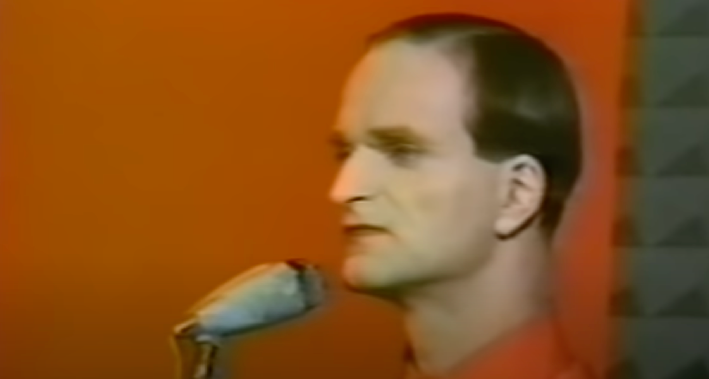

# Vocoder and more

This session is dedicated to the Vocoder, a device to modify the human voice. Furthermore, we use some patches to visualise sound and customize
the appearance of MAX/MSP objects with the inspector.

The music bank "Kraftwerk" became popular with their title "The Robots" back in 1978.

### 1. Create one or two recordings with voice

Record two audio clips to get some speech samples, 

- a longer one with a duration of approx. 30 sec (maybe read a book or text?)
- another shorter xlip with just a short sentence.

The video below shows you the basic process using Audacity, while the interface of the actual version 3.X has changed,
the elements used are still available on the user interface, only their location is different.

Before you start, you need to set in `Audio Setup` the proper `Recording Device`, your microphone. Also, activate the `Record Meter`
to see a level meter show the volume. Your voice should be around -6dB, avoiding a red level.

[Quick introduction on how to record with Audacity][(https://www.youtube.com/embed/knL6uKBGyIg?si=72jXXYisA7fn-xv5)
  web-share" allowfullscreen></iframe>

  At the end do not forget to `Export` your audio clip, either in the .WAV or the .MP3 format.

  ### 2. Launch the patch 240226_VocoderBEAP1.maxpat

  As in previous sessions, download the repository with all contents on your computer, if required extract its files. Then find
  and laumch the patch **240226_VocoderBEAP1.maxpat**.
  Drag and drop on of your audio clips on the patch, a `playlist~` object will be created. Patch it as it is shown for the existing player.

  Then start the patch and experiment with various settings on the Vocoder module.

  ### 3. A descrete Vocoder vox2.maxpat

  This Vocoder is described [here](https://youtu.be/4feOFLX6238?feature=shared) in more detail. You find it in the folder **Vocoder2**. 
  The project consists out of two patches. The main patch vox2.maxpat contains the main program, it uses a subprogram **voc_pfft.maxpat**,
  subprograms in MAX are called *Abstractions*. 
  Launch 
  
  Open the patch **voc2.maxpat**, then link your audio file by 
